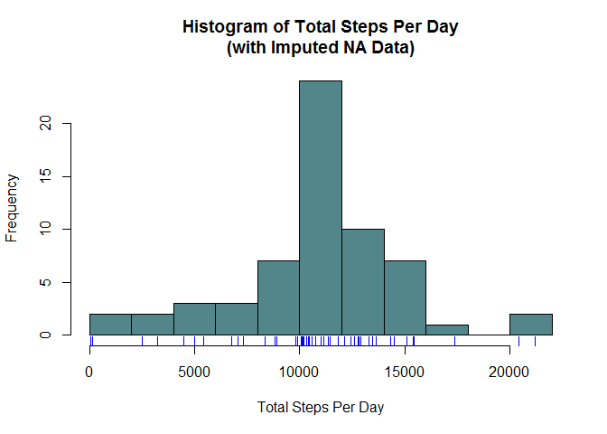
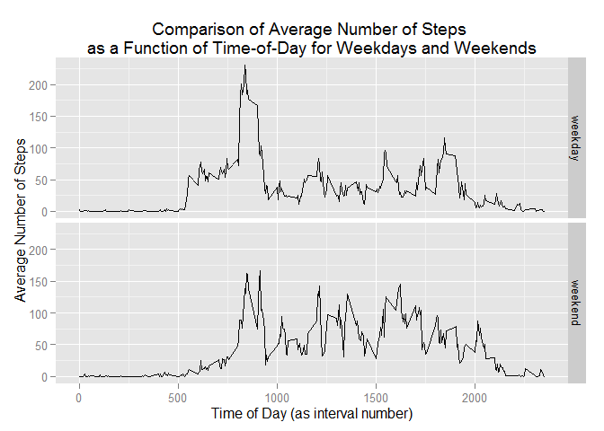

# Reproducible Research: Peer Assessment 1


## Loading and preprocessing the data

Before any analysis, the raw data file must be unzipped and the contents of the
unzipped CSV file read into R.

```r
library(dplyr)
library(ggplot2)
library(lubridate)

unzip( "activity.zip" )
activity <- read.csv( "activity.csv", header=TRUE )
```


## What is mean total number of steps taken per day?

Next we calculate the total number of steps taken per day (ignoring any missing
data) and display this in a histogram.


```r
totStepsPerDay <- 
    na.omit(activity) %>% group_by(date) %>% summarise( total=sum(steps) )

hist( totStepsPerDay$total, breaks=10, col="cadetblue4", border="black", 
      xlab="Total Steps Per Day", main="Histogram of Total Steps Per Day" )
rug( totStepsPerDay$total, col="blue" )
```

 

The mean and median values of the total number of steps taken per day are
computed as follows.


```r
summary( totStepsPerDay$total )
```

```
##    Min. 1st Qu.  Median    Mean 3rd Qu.    Max. 
##      41    8841   10760   10770   13290   21190
```

## What is the average daily activity pattern?

To examine this question we average and display the number of steps at 
each 5-minute interval in a day (using all available data and ignoring any 
missing data).


```r
avgDailyInts <- 
    na.omit( activity ) %>% group_by( interval ) %>% summarise( avg=mean(steps) )

maxInt <- avgDailyInts %>% filter( avg==max(avg) )

ggplot( data=avgDailyInts, aes(x=interval, y=avg) ) + 
    geom_line() + 
    geom_text( 
        data=maxInt, fontface="italic", color="cadetblue4", 
        aes( x=interval+100, y=avg-10, hjust=0, 
             label=paste("Maximum of",round(avg,digits=1),
                         "steps\nat Interval #",interval))) + 
    geom_point(
        data=maxInt, color="cadetblue4", size=5, alpha=0.5, 
        aes(x=interval,y=avg)) + 
    labs(
        x="Time of Day (as interval number)", 
        y="Average Number of Steps",
        title="Average Number of Steps\nas a Function of Time-of-Day")
```

 

The above graph shows the 5-minute interval with the maximum number of
average steps


## Imputing missing values

There are a significant number of observations missing from the data
set.

```r
numMissingSteps <- sum(is.na(activity$steps))
print(numMissingSteps)
```

```
## [1] 2304
```

To potentially ameliorate any impact of missing observations on the results
presented here, we have created a second data set where every missing observation
is replaced with the average number of steps for the 5-minute interval 
corresponding to the missing observation.


```r
idxMissingSteps <- which(is.na(activity$steps))

revActivity <- activity
revActivity$steps[idxMissingSteps] <- round(
    avgDailyInts[ avgDailyInts$interval == 
                           activity$interval[idxMissingSteps] ]$avg )
```

From this revised data set we compute the total number of steps per day and 
display a histogram of that data.


```r
revTotStepsPerDay <- 
    revActivity %>% group_by(date) %>% summarise( total=sum(steps) )

hist( revTotStepsPerDay$total, breaks=10, col="cadetblue4", border="black", 
      xlab="Total Steps Per Day", 
      main="Histogram of Total Steps Per Day\n(with Imputed NA Data)" )
rug( revTotStepsPerDay$total, col="blue" )
```

 

We can see that these efforts yield a data set with the same mean and median
values as the original data set, and a histogram which closely follows that of
the original data set.


```r
summary( revTotStepsPerDay$total )
```

```
##    Min. 1st Qu.  Median    Mean 3rd Qu.    Max. 
##      41    9819   10760   10770   12810   21190
```


## Are there differences in activity patterns between weekdays and weekends?

To explore this question we compare the average number of steps taken during
a particular 5-minute interval on the weekend with the same interval during the
weekdays.


```r
revActivity <-
    revActivity %>%
    mutate( 
        Date = ymd(date), 
        DayType = 
            sapply(Date, function(d)
                {if (wday(d)==7 | wday(d)==1) "weekend" else "weekday"}) )

revAvgDailyInts <- 
    revActivity %>% 
    group_by( DayType, interval ) %>% 
    summarise( avg=mean(steps) )

ggplot( data=revAvgDailyInts, aes(x=interval, y=avg) ) + 
    geom_line() + 
    facet_grid(DayType~.) + 
    labs(
        x="Time of Day (as interval number)", 
        y="Average Number of Steps",
        title=paste("Comparison of Average Number of Steps",
            "\nas a Function of Time-of-Day for Weekdays and Weekends") )
```

 
